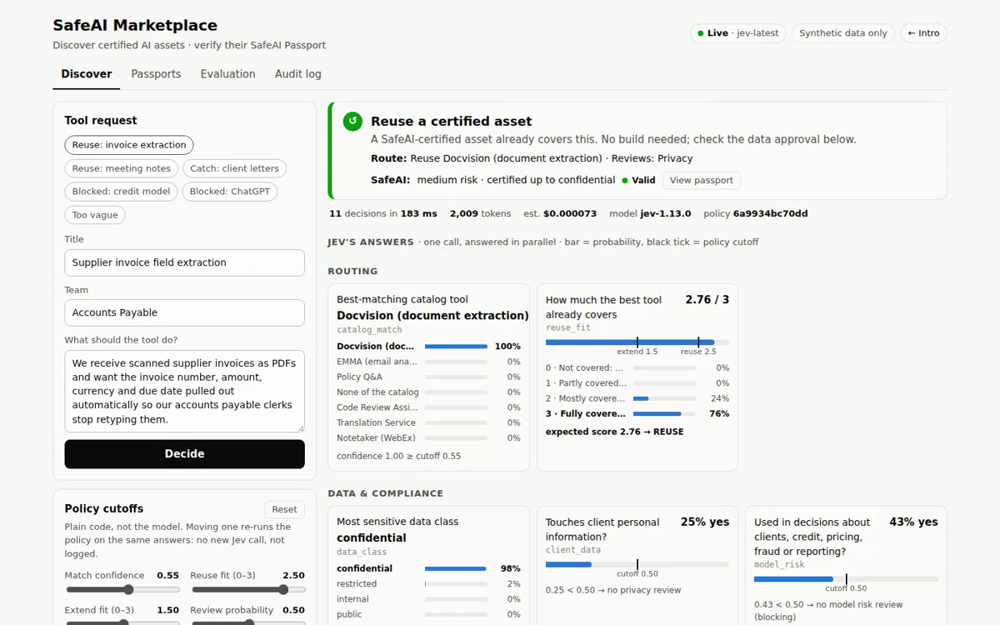

# SafeAI Marketplace POC

A proof of concept for the AI Marketplace, where teams publish AI repos and services
that Pantheon evaluates for SafeAI approval. It adds two pieces:

- **Discover** (uses Jev): describe a need in plain English. Jev answers 11 typed
  questions in one call; plain code decides whether a **certified asset** can be reused
  or extended, whether it's certified for your data, which reviews apply, and whether
  a new build is specified well enough. Nothing is generated.
- **SafeAI Passport** (no AI): every certified asset carries an Ed25519-signed
  certificate. Change one field and it fails verification. Change the code and it's
  suspended until re-certified.

**AI reads, rules decide, people approve, evidence is automatic.**

> **Synthetic data only.** Requests, catalog details, labels and Pantheon checks are
> made up or mocked. Don't enter real RBC or client data: TypeSafe hasn't been through
> vendor, model risk or data-residency review. See [SPEC.md](SPEC.md).

## Try it

| | |
|---|---|
| **One-click demo** | [safeai-marketplace.vercel.app/login?password=safeai-bee6-deb4-fde0](https://safeai-marketplace.vercel.app/login?password=safeai-bee6-deb4-fde0) |
| **Demo link** | https://safeai-marketplace.vercel.app |
| **Password** | `safeai-bee6-deb4-fde0` |

Six intro slides first (arrow keys), then **Start the demo**. Try the example buttons,
drag a policy cutoff, then open **Passports** and run the tamper test.

[](docs/media/safeai-marketplace-demo.mp4)

▶ [Watch the 75-second demo](docs/media/safeai-marketplace-demo.mp4) (recorded on the live site with real Jev calls)

**First live results** (jev-1.13.0, 25 labelled requests, three runs): 88% route accuracy, 100% review recall, 69–72% review precision, ~150–180 ms median per decision, $0.0018 for all 25 calls. Keyword-rules baseline: 60% route accuracy, 78% recall.

Design: [SPEC.md](SPEC.md) · Recording guide: [docs/LOOM_SCRIPT.md](docs/LOOM_SCRIPT.md)

## Run it locally

Requires Python 3.11+ and [uv](https://docs.astral.sh/uv/).

```bash
uv sync
echo "TYPESAFE_API_KEY=your-key-here" > .env
uv run --env-file .env python -m reuse_router.server
```

Open <http://127.0.0.1:8000>: intro slides first, then **Start the demo** (`/app`).
The header should say **Live**. Without a key it runs in **Simulated** mode (keyword
rules, clearly bannered), which is enough to click around but says nothing about Jev.

Score the system against the 25 labelled requests (also records every Jev response so
the demo can be replayed offline with `JEV_MODE=replay`):

```bash
uv run --env-file .env python -m reuse_router.evaluate --mode live
```

## Deploy to Vercel (password-protected)

1. Push this repo to GitHub.
2. Generate a passport signing key: `uv run python -m reuse_router.passport keygen`
3. On vercel.com: **Add New → Project**, import the repo, framework preset **Other**.
4. Under **Environment Variables** add:

   | Name | Value |
   |---|---|
   | `TYPESAFE_API_KEY` | your TypeSafe key |
   | `DEMO_PASSWORD` | the password you'll give viewers |
   | `PASSPORT_SIGNING_KEY` | the value from step 2 |

5. Deploy. Visitors see a sign-in page, then the slides and demo.

To redeploy from a checkout: `npx vercel deploy --prod` (with `VERCEL_TOKEN` set, add `--token "$VERCEL_TOKEN"`).

The key lives only in Vercel's settings, never in the repo; everyone who signs in uses
it through the server. On Vercel the audit log and eval results are temporary (`/tmp`).
Deployed and verified end to end on 28 Sep 2026, including live Jev calls from Vercel.

## Engine modes

| `JEV_MODE` | What it does | Use for |
|---|---|---|
| `live` | Calls Jev; records each response | Real demos and evals |
| `replay` | Serves recorded responses; refuses anything unseen | Offline demos |
| `sim` | Keyword rules, **not a model** | Tests and UI work |

Default: `live` if `TYPESAFE_API_KEY` is set, otherwise `sim`.

## Layout

| Path | What it is |
|---|---|
| `reuse_router/catalog.py` | Marketplace listings with certification metadata (illustrative) |
| `reuse_router/questions.py` | The 11 typed questions Jev answers |
| `config/policy.toml` | Policy cutoffs, as data. Tune these, not code |
| `reuse_router/policy.py` | Pure function: answers + cutoffs → verdict + trace |
| `reuse_router/passport.py` | Issue and verify SafeAI Passports; `keygen` |
| `reuse_router/engine.py` | The only module that imports the TypeSafe SDK |
| `reuse_router/evaluate.py` | Scores the system against `data/eval_set.jsonl`; cutoff sweep |
| `reuse_router/server.py` | Thin FastAPI layer, password gate |
| `reuse_router/static/` | `intro.html` slides, `index.html` demo, `login.html` |
| `api/index.py`, `vercel.json` | Vercel entry point and routing |

## Tests

```bash
uv run pytest
```

Fully offline: the decision contract against the API's schema, a real-SDK round trip
over a mock network, policy boundaries, passport tampering and suspension, and the
password gate.

## Adapting it

1. **Catalog:** replace `reuse_router/catalog.py` with the real listings and metadata.
2. **Pantheon:** swap the mocked checks in `passport.py` for Pantheon's real results.
3. **Labels:** have the policy owners review `data/eval_set.jsonl`.
4. **Cutoffs:** run the eval live, read the sweep chart, set `config/policy.toml`.
